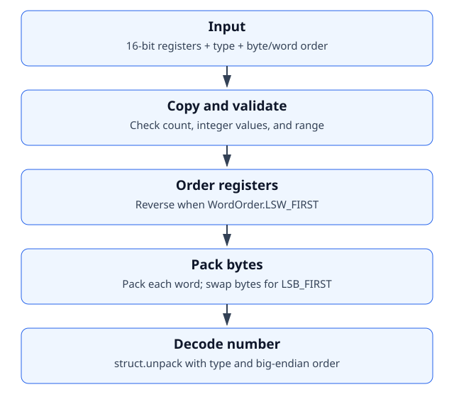

Architecture
============

Current scope
-------------

The package contains one implementation module, ``ecoadapt_exporter.decoder``,
and an empty package initializer. Acquisition, transport, and export layers
are not implemented yet. The decoder uses only the standard library:
``enum.Enum`` defines configuration choices and ``struct.unpack`` converts
packed bytes to a number.

Decoder flow
------------

``decode_registers`` copies its input into a list, so reversal does not mutate
the caller's list. The private ``_validate_registers`` helper checks register
count, integer values, and range. Internal tables map each ``DataType`` to a
register count and a ``struct`` format character.

Maintaining the documentation
-----------------------------

API pages follow source docstrings automatically on each build. This
architecture explanation and SVG are maintained manually as the design
changes. Once more modules exist, a generated import graph can complement
this diagram; imports alone do not describe runtime data flow.
